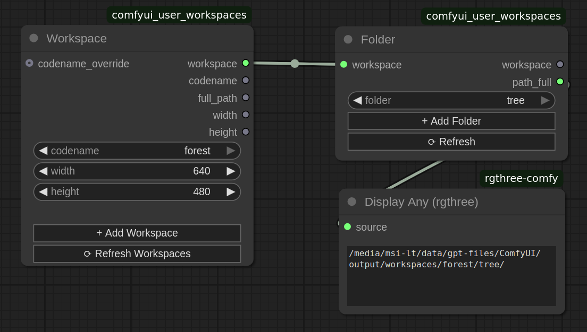

# ComfyUI Workspaces

Tame the chaos of your generated outputs! ComfyUI Workspaces is a 
custom node extension that brings project-based organization to 
your ComfyUI workflow.

## ✨ Features

* 📁 Project-Based Workspaces - Dedicated spaces for each project
* 🗂️ Automatic Folder Structure - Organized under ./output/workspaces/
* ⚙️ Context-Aware Workspaces - Store and have access to: width, height and other properties
* 📂 Flexible Sub-Folders - Create specific directories within workspaces
* 🔌 Easy Integration - Plug full_path into any save node
* 🛠️ Extensible for Developers - Make your nodes workspace-aware

## 🚀 Installation

### Method 1: Via ComfyUI Manager
1. Install ComfyUI Manager
2. Search for "ComfyUI Workspaces"
3. Install and restart

### Method 2: Manual Installation
```bash
cd custom_nodes
git clone https://github.com/wgedeon/comfyui_user_workspaces.git
```

## 🛠️ How to Use

[🎥 Watch Video Tutorial on YouTube](link)



### Workspace Node

* CATEGORY: Feller of Trees/Workspaces
* INPUTS: codename, width, height
* OUTPUTS: workspace (object), and properties

### Folder Node

* CATEGORY: Feller of Trees/Workspaces
* INPUTS: workspace, folder
* OUTPUTS: workspace (object), path_full

## 👨‍💻 For Node Developers

### Workspace Consumer

Declare your node as a workspace consumer, and add the corresponding input:

python:
```python
class MyCustomNode:
    @classmethod
    def INPUT_TYPES(cls):
        ui_features = {
            "is_workspace_consumer": {},
            "is_workspace_producer": {}  # Optional for chaining functionality
        }
        return {
            "required": {
                "workspace": ("WORKSPACE",),
            },
            "hidden": {
                "ui_features": ("STRING", {"default": json.dumps(ui_features)}),
            }
        }

    def process(self, workspace):
        # Access workspace properties
        height = workspace.full_path
        width = workspace.width
        height = workspace.height

# ...
```

### UI Real-Time Updates with Callbacks

javascript:
```javascript
app.registerExtension({
    nodeType.prototype.onNodeCreated = function () {
        this.onWorkspaceUpdated = async (node) => {
            console.log("Workspace updated - refreshing UI");
            // refresh something based on the updated workspace info
        }
    }
});
```

### 🎯 Best Practices

* ✅ Always include ui_features for proper integration

* ✅ Handle optional workspace inputs gracefully

* ✅ Use real-time updates for dynamic UI

* ✅ Clean up resources on workspace changes

* ✅ Provide fallback behavior when no workspace

## 🤝 Contributions are welcome!

## ⭐ Happy and organized generating!